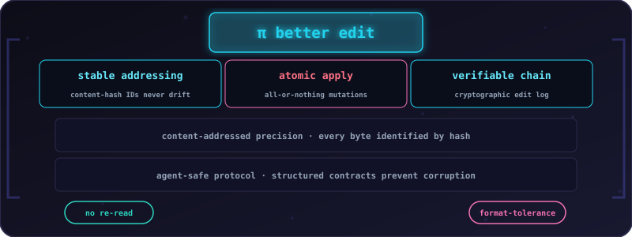

<p align="center">
  
</p>

<h1 align="center">pi-better-edit</h1>

<p align="center">
  <strong>Hash-anchored `read` / `edit` / `undo` tools for pi-coding-agent.<br>
  Edit by content address — not by line number, not by string replacement. Every resolved line is verified against what the model actually saw; a stale or never-served edit is rejected before anything is written.</strong>
</p>

<p align="center">
  <a href="#quick-start">Quick Start</a> •
  <a href="#tools">Tools</a> •
  <a href="#why-hashline">Why Hashline</a> •
  <a href="#comparison">Comparison</a> •
  <a href="#how-anchors-work">How Anchors Work</a> •
  <a href="#development">Development</a> •
  <a href="#acknowledgments">Acknowledgments</a>
</p>

<p align="center">
  
  
  
  
</p>

---

> *"The harness — not the model — is the bottleneck."*
> — Can Bölük, [*The Harness Problem*](https://stencil.so/blog/the-harness-problem)
>
> **Practical advantage: fewer tool calls.** In the recorded coding-agent benchmark, this project completed the same external-drift refactor in **3 tool calls** versus **6 for OMP**. Fewer calls mean fewer model/tool round trips while preserving exact final-file correctness; see the practical benchmark below for the measured sample.

Line numbers shift the moment anything above them changes, and str_replace-style tools
make the model re-type the code it is replacing. Hashline gives every line a **content
address** instead: `edit` targets two 3-character hashes, the old text is never echoed,
anchors survive edits above, and every resolved range is verified against the exact rows
the model was shown. A wrong-line edit cannot silently land.

This is the **self-maintained fork** of [pi-hashline-edit-pro](https://github.com/YuGiMob/pi-hashline-edit-pro)
(which forked [pi-hashline-edit](https://github.com/RimuruW/pi-hashline-edit)). It is not
affiliated with either upstream, and it deliberately diverges where noted below. The
hashline concept descends from [@oh-my-pi/hashline](https://www.npmjs.com/package/@oh-my-pi/hashline);
the [comparison](#comparison) is the honest read of who does what.

## Why you need this

`str_replace` makes the model re-type the code it is replacing — output tokens billed at
~5-6× the input rate — and wrong-line edits are how agents corrupt files: one edit lands
on line 47 instead of 74 because everything above it shifted. Hashline replaces the old
text with two content hashes, so the call never echoes what it replaces, and the tool
checks every line of the resolved range against what the model was shown before writing
anything. Stale anchors and unverified ranges are hard-rejected, and the current range is
echoed back as fresh anchors — the retry needs no `read` (reject-and-serve).

Not for one-line touch-ups (near parity) or brand-new files (`write`). It pays off in long
sessions and structural edits — anywhere an edit must not land on the wrong line.

## Quick Start

### Install

```bash
pi install npm:pi-better-edit
```

From a local checkout:

```bash
pi install /path/to/pi-better-edit
```

| Requirement | |
| --- | --- |
| Node | ≥ 22.19.0 (`engines`) |
| pi-coding-agent | ≥ 0.75.0 (peer dependency) |

`read` returns every line prefixed by its hash — the hash *is* the line's address:

```text
ve7│function hello() {
szJ│  console.log("world");
kQm│}
```

`edit` targets a range of hashes, so edits always land on the lines you meant:

```json
{ "edit": ["src/main.ts", ["szJ", "szJ"], "  console.log('hi');"] }
```

and returns a diff with fresh anchors, so the next edit verifies cleanly with no re-read:

```text
- szJ │   console.log("world");
+ a3m │   console.log('hi');
  kQm │ }
```

Keep editing — anchors for lines you didn't touch stay valid, and auto-read hands you fresh
anchors after each change.

## Tools

| Tool | What it does |
| ------ | -------------- |
| `read` | Returns a text file with every line as `HASH│content`. `offset` (1-based), `limit`. Paged output ends with `[Showing lines N-M of T. Use offset=… to continue.]`. Lines >200KB shown as a marker with a `sed` hint — hash anchors need full lines. |
| `read_skill` | Same file read as plain text — no `HASH│` prefixes, no served rows. For skill content (SKILL.md or any file); records no serves, so editing a file read this way starts with a `[E_RANGE_UNSERVED]` serve on the first edit. |
| `edit` | An object-root payload `{ "path": path, "edits": [[remove_from, remove_to, replacement_text], …] }`; the path may be `null` for anchor-based inference. A single item edits one range; several items batch same-file edits atomically (up to 32). Verifies every line of each inclusive range and reject-and-serve returns fresh anchors. |
| `undo_last_edit` | `{ path }` restores the most recent successful edit with its original content, BOM, line endings, and anchors; persisted across restarts. |

`edit` accepts `{ "path": path, "edits": [[remove_from, remove_to, replacement_text], …] }`. The path
position is a non-empty string or `null` for unique anchor-based inference. Each range is inclusive,
and an empty replacement deletes the range. All items are checked before file I/O and applied
atomically to that one file — one item per call is the norm, several same-file items batch in one call.
`batch_edit` no longer exists as a separate tool.

### Error codes

| Code | Meaning |
| --- | --- |
| `[E_BAD_SHAPE]` | The payload is not the fixed tuple shape, or a tuple member has an unknown, missing, or wrongly-typed value. |
| `[E_BAD_REF]` | An anchor in the inclusive range is not a bare 3-char hash. |
| `[E_STALE_ANCHOR]` | An anchor does not match any line in the current file; call `read` for fresh anchors. |
| `[E_AMBIGUOUS_ANCHOR]` | An anchor matches multiple lines; call `read` for fresh anchors. |
| `[E_INVALID_PATCH]` | A `replacement_text` line is a diff-preview row (`+HASH│`, `-HASH│`, `-   │`). The marker is stripped automatically with a warning. |
| `[E_BARE_HASH_PREFIX]` | A `replacement_text` line starts with a hash-like `HASH│` prefix. The prefix is stripped automatically with a warning. |
| `[E_BAD_OP]` | Range start line is after range end line. The pair is swapped automatically with a warning. |
| `[E_WOULD_EMPTY]` | An edit would empty a non-empty file; use `write` instead. |
| `[E_NOT_FOUND]` | The path does not exist. |
| `[E_ACCESS]` | The path is not readable or writable. |
| `[E_NOT_TEXT]` | The path is a directory, binary file, image, or UTF-16/UTF-32 encoded text; hashline editing only supports text files. |
| `[E_UNDO_STALE]` | `undo_last_edit` refused: the file was modified or deleted after the last edit. |
| `[E_UNDO_UNAVAILABLE]` | Undo history could not be persisted to the hash store; the `edit` was refused and the file was left unchanged. |
| `[E_FILE_TOO_LARGE]` | The file exceeds the 238,328-line hashline limit. |
| `[E_RANGE_STALE]` | A line inside the resolved edit range changed on disk since it was served (read output, diff, or rejection feedback). The edit is refused and the current range is echoed as fresh `HASH│content` rows; retry with those rows (no `read` needed). |
| `[E_RANGE_UNSERVED]` | A line inside the resolved edit range was never served to the model (paged reads, truncated output). The edit is refused and the current range is echoed as fresh `HASH│content` rows. |
| `[E_RANGE_UNVERIFIED]` | A boundary anchor (`remove_from`/`remove_to`) has no served position or was served at multiple positions, so the range cannot be verified against served state. The edit is refused and the current range is echoed as fresh `HASH│content` rows. |
| `[E_NOOP_LOOP]` | The exact same edit (same path, anchors, and replacement) was re-sent and produced no changes 3 consecutive times — the range already contains the replacement. The edit is refused and the current range is echoed as fresh `HASH│content` rows. |
| `[E_BATCH_ABORT]` | A multi-item `edit` call was rejected as a whole: an item failed validation or served-state verification. Nothing was written; the failing item's current range is echoed as fresh `HASH│content` rows. |

## Why Hashline

**Correctness, not just brevity.** Every resolved edit range is verified against the
served rows — what `read`, a post-edit diff, or a rejection echo actually showed the model.
A line inside the range that changed on disk since it was served, or was never served, is
hard-rejected before any file I/O: `[E_RANGE_STALE]` / `[E_RANGE_UNSERVED]` /
`[E_RANGE_UNVERIFIED]`, and the current range is echoed as fresh `HASH│content` rows. The
retry needs no `read`. Served state is **session-keyed** (ADR-0002), so a sub-agent's serves
never validate the main session's edits and vice versa.

**Content-addressed anchors.** Anchors are derived from line content (ASCII-whitespace
stripped), not position: edit one part of a file and the hashes of the rest stay put, so
chained edits need no re-reads. Re-inserting identical text keeps its hash — "edit X with
X" doesn't rotate the anchor. Anchors are unique by construction — repeated `}` or
`import` lines never share one.

**Chained edits without re-reading.** Post-edit diff rows, auto-read rows, and rejection
echoes all count as serves. `read` is on-demand recovery, not a per-edit ritual.

**Stop the loop.** A no-op edit reports `No changes made` and leaves anchors alone; the
same no-op re-sent three times is refused (`[E_NOOP_LOOP]`). `edit` applies up to 32
edits atomically — any stale item aborts the whole batch with `[E_BATCH_ABORT]`.

## Comparison

### Token economics: envelope savings

The compact JSON contract is primarily a **token-saving envelope change**. It removes repeated field names and escaped wrapper syntax while leaving the verified edit semantics unchanged:

- `edit` is one fixed tuple inside an object-root schema: `{ "edit": [path, [from, to], replacement] }`;
- `edit` is a compact tuple array inside an object-root schema: `{ "path": path, "edits": [[from, to, replacement], …] }`;
- replacement text is emitted once, and the old text is never repeated in the call.

#### Theoretical benchmark — serialized envelopes

This benchmark counts only the serialized edit payloads, not model reasoning, tool descriptions, reads, retries, or cache traffic. It compares the same three editing families on two 12-edit fixtures: `str_replace`, this project, and `@oh-my-pi/hashline` (OMP).

| snapshot | `str_replace` | this project: `edit` | this project: `edit` (multi-item) | OMP: per-edit | OMP: one batch |
| --- | ---: | ---: | ---: | ---: | ---: |
| external pinned 12-edit corpus, current-envelope recount | 1,015 | 609 (**40.0%**) | 582 (**42.7%**) | 590 (**41.9%**) | 480 (**52.7%**) |
| local 12-edit configuration snapshot | 358 | 272 (**24.0%**) | 241 (**32.7%**) | 268 (**25.1%**) | 180 (**49.7%**) |

All percentages are savings against the `str_replace` value in the same row. The external row uses the pinned corpus, current object-root tuple envelopes, and current 3-character anchors; the historical sibling record remains available in [`../oh-my-pi.md`](../oh-my-pi.md) (`1015 / 702 / 590 / 480`), where `702` is the older named-field hashline envelope. The local row is reproducible with `npm run benchmark:tokens`; correctness is measured separately with `npm run eval`, `npm run eval:compare`, and `npm run eval:hashline`.

#### Practical benchmark — coding-agent session

This benchmark measures a real coding-agent loop rather than serialized envelopes. The practical advantage is round-trip efficiency: this project completed the scenario in **3 tool calls**, versus **6 for OMP**. `npm run benchmark:practical` runs pi with `opencode-go/gpt-5.6-luna` at `high` thinking. The scenario reads a file, calls bash once to create an external interior change, applies the refactor through the editing tool, and checks the exact final file content. OMP is the practical baseline below; usage totals include pi-reported input, output, reasoning, cache-read, and cache-write tokens.

| engine | tool calls | total tokens | saved vs OMP baseline | final correctness |
| --- | ---: | ---: | ---: | :---: |
| OMP patch wrapper | **6** | 28,467 | 0.0% | ✅ |
| this project (`edit`, multi-item) | **3 (fewest)** | 12,593 | **55.8%** | ✅ |

Both engines preserved the external change and produced the expected final file in this sample. OMP required four patch attempts. This result is one stochastic model run; it must not be read as a universal performance claim. Latest dated artifact: [2026-08-17 practical token benchmark](benchmarks/results/2026-08-17-practical-token-benchmark.md).

### Capability comparison

| | **pi-better-edit** (this) | pi-hashline-edit (original) | pi-hashline-edit-pro (upstream) | @oh-my-pi/hashline |
| --- | --- | --- | --- | --- |
| Layer | pi tools: `read` / `read_skill` / `edit` / `undo_last_edit` | pi tool override: `read` / `edit` + opt-in `grep` | pi tools: `read` / `replace` / `undo_last_replace` | patch-engine library: `Patcher` / `Patch` / `Filesystem` / `SnapshotStore` |
| Address format | `HASH│` — 3-char content hash, no line number | `LINE#HASH:` — line number + 2-4 char hash | `HASH│` — 3-char content hash, no line number | `[path#tag]` — full-file content tag + line numbers |
| Whitespace-insensitive anchors | ✅ all ASCII whitespace stripped — survives reformatting | ❌ exact content match | ~ trailing whitespace trimmed only | ~ n/a (anchors are line numbers) |
| Duplicate lines | ✅ unique per line (collision-resolved); ambiguity → `[E_AMBIGUOUS_ANCHOR]` | ~ shared hash — repeats are ambiguous | ✅ unique (collision-resolved) | ~ position-based — repeats fine, position unverified |
| Verified against what the model saw | ✅ every resolved line, per session | ❌ hash-vs-content only, no served record | ~ served-state, but blind-edit (B8) and cross-session (B22) holes | ~ seen-lines provenance + file-version tag (H7) |
| Stale interior | ✅ reject + fresh anchors (`[E_RANGE_STALE]`) | ~ line-hash mismatch → 3-way recovery or fresh anchors | ~ version-dependent: 2.4.1 overwrote silently, 2.5.x rejects | ~ recovery-with-warning, else `MismatchError` |
| Blind edit — lines never shown | ✅ hard reject (`[E_RANGE_UNVERIFIED]` / `[E_RANGE_UNSERVED]`) | ❌ applies | ❌ applies (B8) | ~ reject when seen-lines recorded (H7) |
| Batch atomicity | ✅ `edit` multi-item — all-or-nothing, `[E_BATCH_ABORT]` | ~ op array, one snapshot, bottom-up | ❌ one `replace` per call | ✅ multi-section preflight (H8) |
| Undo (persisted) | ✅ survives restarts | ❌ | ✅ `undo_last_replace`, persisted | ❌ none |
| `grep` tool | ❌ | ✅ opt-in | ❌ | ❌ |
| Sub-agent session isolation | ✅ session-keyed served state (B19–B22) | — | ❌ leak (B22) | ~ |
| Deterministic battery | ✅ 23/23 | — schema differs, design-only | 17/23 (2.4.1) · 21/23 (2.5.x) | ✅ 10/10 library |
| Runtime | pi (Node) | pi (Node) | pi (Node) | Bun ≥ 1.3.14 (TS source) |

> `~` = occasionally / inconsistently. `—` = not specified / not applicable.

### Different jobs, same lineage

Both this extension and `@oh-my-pi/hashline` descend from the harness-problem insight that
the model should never re-type old code, but they are different layers.

`@oh-my-pi/hashline` is a **patch-language library**: `[path#tag]` headers bind every hunk
to a full-file content hash, `PUT N.=M:` addresses lines by number, and it ships multi-hunk
documents, a pluggable filesystem for any backend (disk, in-memory, network), and
session-aware 3-way-merge recovery on stale tags. Its payload per edit is lighter and it cannot
be confused by repeated text — the line number is unambiguous.
This extension is a **pi tool pair**: `read` hands the model 3-char content hashes, `edit`
takes two of them, and every resolved line is verified against the served state — no line
numbers to renumber, no tag to refetch, a wrong anchor can never land on the wrong line,
and `undo_last_edit` survives restarts. Its trade-offs: a JSON envelope per edit costs a
little payload, and it lives inside pi (Node) rather than as a standalone patcher (Bun). Pick
hashline-the-library for a cross-backend patch format; pick hashline-the-tool for verified,
content-addressed edits in your agent. Syntax-aware structural edits and file-lifecycle operations
remain outside this verified line-range contract.

Against the two pi extensions in the family: the **original** `pi-hashline-edit`
introduced line+hash anchors and grep-to-edit, but has no served-state record (it verifies
hash-vs-content), no persisted undo, and its duplicate lines share an anchor. **pro**
hardened the format to pure 3-char hashes with collision resolution and added the
served-state check, persisted undo, and auto-read; the deterministic battery shows what a
self-maintained fork keeps fixing — 2.4.1 overwrote drifted interiors silently, 2.5.x
rejects them but still lets a blind edit and a cross-session serve through. This fork
closes those with session-keyed, per-line served-state verification plus multi-item `edit`.

### Refinements over upstream

- **`edit` / `undo_last_edit`** — renamed from `replace` / `undo_last_replace`; this
  extension's `edit` replaces pi's built-in edit tool.
- **Served-state range verification** — every line of the resolved range is verified
  against what the model was shown, not just the two boundary anchors; a changed or
  never-served interior is hard-rejected with `[E_RANGE_STALE]` / `[E_RANGE_UNSERVED]` /
  `[E_RANGE_UNVERIFIED]`, and the current range is echoed as fresh anchors (reject-and-serve).
- **Session-keyed served state** — sub-agent serves never leak into the main session
  (ADR-0002; battery B19–B22).
- **Drift notices** — served territory outside the edit range that changed on disk is
  reported as an informational notice, once per episode.
- **Chained edits without re-reading** — post-edit diff rows and rejection echoes count as
  serves; `read` is on-demand recovery, not a per-edit ritual.
- **`edit` (multi-item)** — up to 32 edits to one file in one atomic call; all-or-nothing with
  `[E_BATCH_ABORT]` and fresh-anchor feedback for the failing item.
- **Whitespace-insensitive anchors** — all ASCII whitespace is stripped before hashing, so
  formatter passes that reindent don't invalidate anchors (ADR-0005); unique anchors by
  construction (bitset probing, ADR-0003).
- **Own identity** — published as `pi-better-edit`, with its own config and hash-store
  directory (`~/.config/pi-better-edit`).

### Correctness in edge cases

The battery below measures *behavior*, where the two hashline implementations actually
diverge. These are the real failure modes from the harness-problem literature, and what
each tool does when they hit:

| Edge case | hashline `edit` (this extension) | @oh-my-pi/hashline patch |
| --- | --- | --- |
| Wrong address (off-by-one anchor / line number) | **Impossible** — anchors resolve to specific lines; every resolved line is verified against served state, rejected before anything is written | **Possible** — a wrong line number against a current tag applies silently at the wrong place; the tag proves the file version, never the lines |
| File changed on disk after the model's view | Hard reject + fresh anchors echoed (reject-and-serve); retry needs no `read` | Tag mismatch → refuse **or** best-effort 3-way merge onto unknown current content, with an explicit recovery banner |
| An edit above shifts the file | Nothing shifts — anchors are content addresses; the diff serves fresh anchors | **Every edit renumbers** — the format's own #1 rule is "re-ground after every edit"; the model carries the bookkeeping |
| Repeated / identical text | Per-line hashes are unique (collision-resolved); ambiguity → `[E_AMBIGUOUS_ANCHOR]` | Position-based, so repeats don't confuse it — but the position itself is unverified |
| Lines never shown to the model | `[E_RANGE_UNSERVED]` — hard reject with fresh anchors | Undisplayed hunks rejected when seen-lines are recorded — same reliance on the model knowing what it saw |
| Multi-edit batch fails mid-way | `edit` multi-item — atomic, all-or-nothing; the failing item is echoed as fresh serves | Multi-section patches preflighted up front — also atomic |

> The oh-my-pi payload saving is a lighter wire format; the table above is what that format
> asks the model to hold in its head instead — renumbering, tag-chasing, node choice — the
> exact component that fails most with replace-style edits. This extension's contract is:
> a wrong edit cannot land, and any rejection needs no re-read. Measured on the same
> stale-serve scenarios, both engines gate the same guarantee — **stale edits are detected,
> never silently applied** — with different policies when drift is found (recover-with-
> warning vs fail-closed rejection).

### Reproducible benchmark

The claims above are measured, not asserted. Two deterministic batteries — no LLM in the
loop, no sampling: a run either reproduces or it doesn't. That trades stochastic headline
numbers for something narrower but exact: stale edits are rejected before they corrupt
files, on every run.

**Tool battery — 23 scenarios, same tool seam, three targets (2026-08-17):**

| vs expected verdict | correct | silent data-loss cases |
| --- | --: | --: |
| **this fork (1.1.3)** | **23/23** | 0 |
| `pi-hashline-edit-pro@2.4.1` (fork base) | 17/23 | 5 silent data-loss cases (B3, B7, B8, B10, B15) + B22 cross-session leak |
| `pi-hashline-edit-pro@2.5.3` (latest) | 21/23 | B8 blind-edit + B22 cross-session leak |

**oh-my-pi comparison boundary:** `@oh-my-pi/hashline` is not runnable through this pi tool seam. Its separate library battery covers 10 comparable scenarios and is reported as 10/10 for version 17.3.5; reproduce it with `npm run eval:hashline`. This is a library-layer reference, not an extra row in the 23-scenario tool-battery table.
The four interior-drift failures (B3, B7, B10, B15) are the exact data-loss class the
served-state range verification exists to prevent: the file changed inside the edit range
after it was read, and the upstream `replace` applied anyway, silently overwriting the
drifted lines. B8 is the blind-edit case: an edit anchored on a boundary line the model
was never shown still landed, overwriting unseen content. B22 — present in both versions —
is the cross-session serve leak.

**Library battery — `@oh-my-pi/hashline` 17.3.5, 10/10 (2026-08-17):** the hashline patch
engine is tested in its own model: stale tags are either recovered with an explicit
`Recovered from a stale file hash…` warning or rejected with a `MismatchError` — never
silently applied (H2/H3), head/tail inserts warn on drift (H4), unseen anchors reject then
retry cleanly (H7), multi-section patches preflight before any write (H8).

Full method, per-scenario tables, and limitations: [benchmarks/README.md](benchmarks/README.md)
and [benchmarks/results/](benchmarks/results/).

### Reproduce

```bash
npm run eval            # this fork, 23/23
npm run eval:compare    # + upstream pi-hashline-edit-pro 2.4.1 / 2.5.x
npm run eval:hashline   # + @oh-my-pi/hashline (installs bun into a temp dir)
```

`eval:compare` installs the requested package versions into `node_modules` temporarily
(`--no-save --no-package-lock`), runs the same 23 scenarios against each target, prints a
per-scenario correctness table plus aggregate call/chars counts, then restores
`node_modules` to the lockfile state. `eval:hashline` scratch-installs `@oh-my-pi/hashline`
and the bun runtime; nothing lands in this repo. The original `pi-hashline-edit` (0.8.3)
is **not** runnable in the tool battery — its edit envelope (`edits: [{op, pos, lines}]`)
and `LINE#HASH:` read format differ from the `remove_from`/`remove_to` schema — so it is
compared by design, not by score.

> **Scope & honesty.** The batteries below are correctness gates, not throughput numbers:
> they do not claim token, cost, or latency performance. The token table above is a separate,
> pinned `cl100k_base` envelope snapshot with its own reproduction instructions. "Calls" / "chars"
> aggregates in the results are the batteries' own transcript sizes, included only for
> cross-version comparability. Dated results live in `benchmarks/results/`; when you re-run and
> numbers drift, commit a new dated file rather than editing an old one.

## Undo

`undo_last_edit` reverts the most recent successful `edit` on a file, restoring the exact
previous content, BOM and line endings included, plus the previous anchors.

- History is per-file and single-level: only the most recent edit can be reverted.
- History is persisted and survives session restarts. A failed `write` does not clear it.
- Every applied edit is undoable: the undo record is saved before the edit is written.
- A successful `write` clears the history for that file.
- If the file was modified or deleted since the last edit, the undo is refused
  (`[E_UNDO_STALE]`) rather than overwriting those changes.

## Auto-read

Always on. After a successful `write` that changes the file, the extension reads the file
and appends an `--- Auto-read (hashline anchors) ---` block to the result, so you get
fresh `HASH│content` anchors without a separate `read` call.

- After `edit` and `undo_last_edit`, the result shows the post-edit diff. The `+HASH│` and
  `HASH│` rows carry the current hashes, so follow-up edits can anchor on the diff
  directly. The `-HASH│` rows show removed lines with their old hashes (stale after the
  edit). Call `read` when you want the full file's anchors.
- Auto-read keeps a 50KB display budget. Lines over 50KB are skipped with a marker instead
  of their content (use `read` for lines up to 200KB).

`read` edge cases: images (JPEG, PNG, GIF, WebP) come back as visual attachments; binary
files and directories are rejected with a descriptive error; UTF-16 and UTF-32 text
(detected via BOM) is rejected, since editing it would corrupt the file; empty files come
back as a single empty-line hash (`HASH│`), use `edit` on that hash to insert content;
BOMs are stripped for display, non-UTF-8 bytes are shown as `U+FFFD` and editing such a
file rewrites it as UTF-8 with a warning; files over 238,328 lines are rejected with
`[E_FILE_TOO_LARGE]`.

## How Anchors Work

Each line is canonicalized (all ASCII whitespace — spaces, tabs, carriage returns, and
line feeds — stripped) and hashed with [xxhash-wasm](https://github.com/jungomi/xxhash-wasm)
(xxHash32), then mapped to a 3-character string over `A-Za-z0-9` — 62³ = 238,328 possible
anchors. Canonicalization keeps anchors stable across formatting passes and editor-save
cycles: a line that changes only in ASCII whitespace keeps its anchor, so external linting
between edits does not invalidate it. Everything that is not ASCII whitespace stays
significant — string contents, regex classes, comments, quotes, semicolons, and Unicode
whitespace (NBSP) all rotate the anchor. One caveat: ASCII whitespace *inside* string
literals and regexes is stripped too, so a whitespace-only change within a string is
invisible to verification — benign in practice because formatters never alter string
contents. Token-level edits (quote style, semicolons, brace placement) therefore still
reject as stale.

The alphabet is sized for an LLM consumer — the model tokenizes rather than squinting at
glyphs, so case and digits are all included. The URL-safe specials `-` and `_` are
deliberately excluded: a hash starting with `-` is shape-identical to a diff-preview
deletion row, and `-`/`_` at a line start are markdown-active, inviting mis-copying.

Anchors are unique by construction. If a line's base hash collides with an already-assigned
hash, the next free hash is allocated from a bitset by probing with a stride coprime to the
hash space (O(1) amortized; the stride is 62² + 62 + 1, so runs of blank lines or repeated
`}` land on anchors that differ in all three characters). Every line therefore gets a
unique anchor; two byte-identical lines never share one. The same guarantee sets the file
size cap: at most 238,328 lines per file, beyond which `read` and `edit` reject with
`[E_FILE_TOO_LARGE]` (use `write` for very large files).

Hashes live in a persistent per-file store
(`~/.config/pi-better-edit/hash-store.sqlite`, honoring `XDG_CONFIG_HOME` on
non-Windows) that keeps the hashes of unchanged lines across edits. When a range is edited,
the runtime maps the old content onto the new content and copies hashes for lines that
survived; only genuinely new lines get fresh hashes. Two guarantees make this safe even
with duplicated content:

- An edited range never borrows a hash from a line outside it. Lines outside the edited
  range keep their hashes unconditionally, even when their content is byte-identical to
  lines inside the range.
- Re-inserted identical text keeps its hash. If replacement content matches a line that
  was just removed, the removed line's hash is reused. "Edit X with X" doesn't rotate the
  anchor.

A no-op edit never changes the file, so anchors remain valid. On first run after upgrading
from an older version, the previous `hash-store.json` is imported once and renamed to
`hash-store.json.bak`.

## Troubleshooting

- Stale anchors. `[E_STALE_ANCHOR]` or `[E_AMBIGUOUS_ANCHOR]` mean the file changed since
  the anchors were read. Call `read` for fresh anchors and retry.
- Reset the hash store. Anchors live in
  `~/.config/pi-better-edit/hash-store.sqlite` (with `-wal`/`-shm` sidecars). Quit
  pi, delete those three files, and the store is rebuilt on the next session. Anchor
  history is lost, but no project files are touched.
- Corrupt store. If the store fails its health check it is renamed to
  `hash-store.sqlite.corrupt-<timestamp>` and rebuilt automatically.
- Config directory moved. On non-Windows platforms, if `XDG_CONFIG_HOME` is set, the
  config directory (and the hash store inside it) lives at
  `$XDG_CONFIG_HOME/pi-better-edit` instead of `~/.config/pi-better-edit`. An
  existing store is not migrated automatically; move the old `hash-store.sqlite` files
  (plus sidecars) into the new directory before the first run.
- Package renamed. This fork was renamed from `pi-hashline-edit-pro` to
  `pi-better-edit` (published earlier as `pi-hashline-edit-lsz`); the config directory
  moved to `~/.config/pi-better-edit`. An existing store is not migrated automatically.

## Development

Requires [Node.js](https://nodejs.org) ≥ 22.19 and npm.

```bash
npm install
npm test
npm run lint
npm run typecheck
```

Set `PI_HASHLINE_DEBUG=1` to show an "active" notification at session start.

**Runtime edge-suite.** `npm run test:runtime` runs the served-state edge scenarios
(stale-interior reject-and-serve, chained edits without re-read, undo, never-served
interior, drift notice) as one `fabric_exec` program against real pi, using the
temporary-extension form (`pi -e npm:pi-fabric`) so nothing is installed into your pi. It
needs network access to install the temp extension and takes a few minutes; exit code 0
means the suite passed.

**Evaluation.** The [Comparison](#comparison) section's reproducible benchmark is produced by the same commands:
`npm run eval`, `npm run eval:compare`, `npm run eval:hashline` — all `RUN_EVAL`-gated so
none of it runs in `npm test`.

## Contributing

Open an [issue](https://github.com/Rianico/pi-better-edit/issues) or PR. The most
valuable contributions right now are more battery scenarios and edge-case tests for the
served-state verification.

## License

[MIT](LICENSE).

## Acknowledgments

Hash-anchored editing descends from Can Bölük's
[*The Harness Problem*](https://stencil.so/blog/the-harness-problem). This project stands
on the shoulders of:

- [**pi-hashline-edit**](https://github.com/RimuruW/pi-hashline-edit) by RimuruW — the
  original pi-coding-agent extension that introduced hash anchors and the strict-semantics
  policy.
- [**pi-hashline-edit-pro**](https://github.com/YuGiMob/pi-hashline-edit-pro) by YuGiMob —
  the hardened fork this project is self-maintained from (3-char hashes, collision
  resolution, served-state verification, persisted undo).
- [**@oh-my-pi/hashline**](https://github.com/can1357/oh-my-pi/tree/main/packages/hashline)
  by can1357 — the original oh-my-pi implementation and the hashline patch-language concept.
