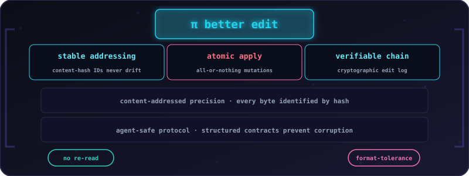

<p align="center">
  
</p>

<h1 align="center">pi-better-edit</h1>
<p align="center">
  <strong>Production-grade, hash-anchored file editing for &pi;.<br>
  Powered by Content-Addressed Line-Identity MVCC &mdash; no line numbers, no re-typing old code, no heuristic guessing, and zero silent miswrites.</strong>
</p>

<p align="center">
  <a href="#systematic-architecture"></a>
  <a href="#quick-start"></a>
  <a href="#reproducible-benchmarks"></a>
  <a href="https://www.npmjs.com/package/pi-better-edit"></a>
  <a href="https://www.npmjs.com/package/pi-better-edit"></a>
  <a href="https://huggingface.co/spaces/alexshpunt/benchmark-explorer?card=harness%3Api-better-edit%40latest"></a>
  <a href="LICENSE"></a>
</p>

<p align="center">
  <a href="#why-you-need-it">Why You Need It</a> •
  <a href="#core-pillars">Core Pillars</a> •
  <a href="#quick-start">Quick Start</a> •
  <a href="#systematic-architecture">Architecture</a> •
  <a href="#tools">Tools</a> •
  <a href="#error-and-warning-contract">Errors & Warnings</a> •
  <a href="#comparison">Comparison</a> •
  <a href="#reproducible-benchmarks">Benchmarks</a>
</p>

---

> **What is `pi-better-edit`?**
> A high-precision file editing extension for [`pi-coding-agent`](https://github.com/can1357/oh-my-pi) that replaces volatile line numbers and token-wasting code echoes with immutable, content-addressed 3-character line hashes (`szJ│code`).
>
> **Core Philosophy:** Local compute is free; **the model's context window is the most precious resource**. By shifting verification, snapshotting, and alignment to the host, `pi-better-edit` slashes output tokens by 40–60%, auto-rebases external file drift (e.g., Prettier, Git), and eliminates silent miswrites without forcing full-file re-reads.

---

## Why You Need It

### The 3 Fatal Editing Traps of Autonomous Coding Agents

File editing is the #1 point of failure for autonomous agents. Traditional tools break down in three distinct ways:

| Fatal Trap in Traditional Tools | Why It Breaks Agents | How `pi-better-edit` Solves It |
| --- | --- | --- |
| **`str_replace` Token Bleed** | Must re-type 30+ lines of unchanged code just to change 1 line ($O(S+R)$), burning expensive output tokens (billed ~5–6× input). | **$O(R)$ Payloads**: Sends only two 3-char hashes (`anchor_from`, `anchor_to`) + replacement. Cuts output tokens by 40–60%. |
| **Line-Number Coordinate Rot** | Inserting 1 line shifts all line numbers below it. Agents suffer off-by-one errors or must repeatedly re-read the file. | **Position-Independent Anchors**: Line hashes follow content, not line coordinates. Exterior shifts auto-rebase cleanly. |
| **Silent Miswrites & Drift** | Duplicate lines match the wrong function; external formatters (Prettier) or git updates cause blind overwrites or fatal errors. | **Line-Identity MVCC**: Unique anchors via coprime probing; format-tolerant whitespace hashing; fail-closed reject-and-serve. |

> [!NOTE] Empirical Grounding
> Published findings corroborate the failure modes above:
> - **Token Bleed**: Line-anchored feedback cut repair tokens by 22–58% while improving patch correctness in paired experiments ([Lamberti 2026, arXiv:2607.12713](https://arxiv.org/abs/2607.12713)).
> - **Silent Drift**: Subword tokenizers drift across model versions, so tools must select anchors from tokenizer-stable regions ([TokDrift, arXiv:2510.14972](https://arxiv.org/abs/2510.14972)).

---

## Core Pillars

### 1. 🪙 Token Economics (40–60% Context Savings)
- **$O(R)$ Edit Payloads**: The model emits only `{ "anchor_from": "a1b", "anchor_to": "c3d", "text": "..." }`, never regurgitating existing code.
- **Self-Serving Diffs**: Every applied edit returns fresh anchors in the post-edit diff — zero re-read roundtrips to chain edits.
- **Disjoint Multi-Window Reads**: Query up to 16 disjoint slices (`windows: [{offset, limit}, ...]`) in one turn instead of dumping 2,000 lines into context.
- **Zero-Token Auto-Rebase**: Non-conflicting shifts resolve locally via $O(m \log m)$ Patience LIS alignment — 0 tokens, 0 retries.
- **Atomic Multi-Item Batches**: Apply up to 32 same-file edits in one tool call; overlapping spans abort atomically before touching disk.

### 2. 🛡️ Resistance to External Writes (Drift & Concurrency)
- **Auto-Formatter Immunity**: Strips a frozen 28-code-point whitespace class ([ADR-0029](docs/adr/0029-canon-v3-frozen-whitespace-class.md)) before hashing, so Prettier, Black, gofmt, and rustfmt format-on-save passes do not rotate anchors. Not total immunity: measured formatter churn includes rewriting U+200B ZWSP to a space, which rotates the affected anchor and fails closed.
- **Exterior Shift Auto-Rebase**: External edits, git checkouts, or background processes outside the edit span rebase seamlessly without agent intervention.
- **Fail-Closed Reject-and-Serve**: Contested interior spans fail closed without disk corruption and immediately return fresh on-disk rows in the error (`[E_STALE_RANGE]`, `[E_UNVERIFIED_RANGE]`) — recovering in **exactly 1 turn**.
- **Session-Keyed Leases**: Leases are isolated per session (`served_leases`), preventing cross-agent race conditions or state pollution.

### 3. 🎯 Zero Silent Miswrites (Formal MVCC)
- **Decoupled Line Identity**: Every line is tracked by an immutable, monotonic `line_id` in CAS snapshot storage, not ephemeral coordinates.
- **Collision-Free Anchors**: Coprime bitset probing ensures duplicate lines in a file receive distinct, unambiguous 3-character hashes.
- **No Heuristic Guessing (ADR-0016)**: Retires fuzzy matching. If an anchor cannot be unambiguously resolved via lease lineage, it fails closed safely.
- **Persisted Undo**: `undo_last_edit` restores exact file content, BOM, line endings, and original anchors, persisting across session restarts.

---

## Quick Start

### Installation

```bash
# From npm
pi install npm:pi-better-edit

# From GitHub
pi install git:github.com/Rianico/pi-better-edit

# From local directory
pi install /path/to/pi-better-edit
```

Zero configuration required. `pi` automatically activates the extension on start.

| Runtime Requirement | Supported Version |
| --- | --- |
| Node.js | &ge; 22.19.0 |
| `pi-coding-agent` | &ge; 0.75.0 (peer dependency) |

### How It Works

#### 1. Read the file
`read` returns each line prefixed by a stable 3-character hash anchor:

```text
ve7│function hello() {
szJ│  console.log("world");
kQm│}
```

#### 2. Apply an edit
`edit` targets inclusive anchor bounds using the canonical named-object payload:

```json
{
  "file": "src/main.ts",
  "edits": [
    {
      "anchor_from": "szJ",
      "anchor_to": "szJ",
      "text": "  console.log('hi');\n"
    }
  ]
}
```

#### 3. Receive the diff with fresh anchors
The tool applies the edit and returns a unified diff showing fresh anchors for subsequent edits—eliminating the need for follow-up `read` calls:

```text
- szJ │   console.log("world");
+ a3m │   console.log('hi');
  kQm │ }
```

#### 4. Batch multiple edits atomically
Batch up to 32 edits to the same file in a single transaction. If any edit fails or overlaps, none write:

```json
{
  "file": "src/main.ts",
  "edits": [
    { "anchor_from": "a1b", "anchor_to": "a1b", "text": "// Header comment\n" },
    { "anchor_from": "c3d", "anchor_to": "c3d", "text": "  return true;\n" }
  ]
}
```

---

## Systematic Architecture

`pi-better-edit` v2 replaces ad-hoc string matching and heuristic healing with a formal Multi-Version Concurrency Control (MVCC) architecture.

```text
┌──────────────────────────────────────────────────────────────────────────────────┐
│                                STORAGE TIER                                      │
│  src/hash-store.ts & src/snapshot-store/                                         │
│  - file_snapshots: CAS snapshots (snapshot_id, path, snapshot_hash, line_count)  │
│  - line_lineage: Coordinate authority (snapshot_id, line_number) -> (line_id)    │
│  - line_id_counters: Monotonic integer block allocator per path                  │
│  - served_leases: Session-keyed immutable leases (session_id, file_path, anchor) │
│  - file_undo: Snapshot-pinned undo history surviving restarts                    │
└────────────────────────────────────────┬─────────────────────────────────────────┘
                                         │
┌────────────────────────────────────────▼─────────────────────────────────────────┐
│                                SESSION TIER                                      │
│  src/served-session/session.ts                                                   │
│  - Leases: Granted on every serve path: read, diff, write auto-read, truncated   │
│    serves, fresh-read rejections, undo (see §1)                                  │
│  - Immutability: Leases are strictly READ-ONLY during edit resolution            │
│  - Re-Serve Upsert: Atomic upsert updates leases when presentation changes       │
└────────────────────────────────────────┬─────────────────────────────────────────┘
                                         │
┌────────────────────────────────────────▼─────────────────────────────────────────┐
│                       RESOLUTION & REBASE TIER                                   │
│  src/hashline/lease-resolve.ts & src/hashline/served-verification.ts             │
│  - On-Demand CAS Materialization: Materializes current disk state                │
│  - Patience LIS Pin Backbone: O(m log m) non-crossing line alignment             │
│  - Minimal Displacement Tie-Breaking: Deterministic unique pairing               │
│  - Span Contiguity Gate: Asserts interior span is not torn                       │
└────────────────────────────────────────┬─────────────────────────────────────────┘
                                         │
┌────────────────────────────────────────▼─────────────────────────────────────────┐
│                                MUTATION TIER                                     │
│  src/mutation-engine/pipeline.ts & src/hashline/apply.ts                         │
│  - Working Buffer: Preceding delta rebase for multi-item batches                 │
│  - WAL Lineage Commit: Atomically commits final snapshot and updates leases      │
│  - Fail-Closed Intercepts: Rejections emit fresh read ranges                     │
└──────────────────────────────────────────────────────────────────────────────────┘
```

### 1. Immutable Line Identity & Leases
- Every line has an immutable surrogate key (`line_id`) allocated from a monotonic counter (`line_id_counters`).
- When lines are delivered to an agent on any serve path — a default (`served`) `read`, diffs, the `write` auto-read hook, truncated serves, fresh-read rejections, or `undo_last_edit` — a session-scoped lease (`served_leases`) binds `(session_id, file_path, anchor) -> line_id`.
- During an `edit`, lease lookups are strictly **read-only**. An edit cannot re-stamp or guess a lease.

### 2. Multi-Version Snapshot Lineage
- Content-addressed CAS snapshots (`file_snapshots`) track each materialized file version.
- `line_lineage` maps each line coordinate to its immutable `line_id`, 32-bit canon hash, and verbatim presentation anchor.
- When disk content shifts externally, the tool pairs the latest snapshot ($S_{latest}$) with disk using Patience LIS alignment, preserving identities for surviving lines and allocating fresh IDs only for novel lines.

### 3. Patience LIS Pin Backbone ($O(m \log m)$)
- Uniquely matching anchor pins form candidate pairs.
- The engine computes the Longest Increasing Subsequence (LIS) via patience sorting in $O(m \log m)$ time.
- Multiple maximal LIS candidates are disambiguated by minimal total displacement ($\sum |p_i - c_i|$).
- Contested symmetric swaps (e.g. equal-length function swaps) or ambiguous duplicate blocks fail closed, marking affected lines as retired rather than guessing.

### 4. Working Buffer with Preceding Deltas
- Multi-item batches (`edits: [e_0, e_1, ...]`) resolve their baseline coordinates $s'_k$ in the current snapshot.
- Active in-memory buffer positions are computed by accounting strictly for preceding edits:
  $$\Delta_k = \sum_{j < k, s'_{end, j} < s'_{start, k}} \left( |R_j| - (s'_{end, j} - s'_{start, j} + 1) \right)$$
- If any two edit items overlap or nest, the batch aborts atomically (`[E_BATCH_ABORT]`) before modifying disk.

### 5. Unified Span Verification (ADR-0023)
- `resolveLeasedEdit` verifies the entire span against `line_lineage` before touching disk.
- Canon evidence is file-scoped and verified via 32-bit digests (`canon_hash`), eliminating duplicate plaintext storage.

---

## Tools

| Tool | Parameters | Description |
| --- | --- | --- |
| `read` | `file`, `offset` (1-based), `limit`, `windows` (optional), `mode` (optional) | Returns file content formatted as `HASH│content` by default. `mode: "verbatim"` returns plain text with no hash prefixes and records no leases; the default `"served"` leases every shown line. Lines &gt;50KB are replaced with a marker hint. `windows: [{offset, limit}, …]` reads up to 16 disjoint ranges in one turn: each renders under `=== Lines A-B of N ===` and, in the default `"served"` mode, every shown line is leased, so anchors from all of them work in one `edit`. |
| `edit` | `file`, `edits`, `mode` (optional) | Applies single or batched edits atomically. Each item bounds an inclusive `anchor_from`/`anchor_to` range, places its payload with optional `at`, and carries exactly one payload — `text` or `text_ref`. `mode: "literal"` declares verbatim text. |
| `undo_last_edit` | `path` | Restores the previous file state, BOM, line endings, and original anchors. Persists across restarts. |

### Payload Contract

```json
{
  "file": "src/example.ts",
  "edits": [
    {
      "anchor_from": "a1b",
      "anchor_to": "c3d",
      "text": "const status = 'ready';\n"
    }
  ],
  "mode": "general"
}
```

An edit item is **flat, with no discriminator field**: it bounds its range with the inclusive
anchor pair, places its payload with the optional `at`, and carries **exactly one payload** —
`text` or `text_ref`. Both or neither is refused with the offending keys named. No operation tag
exists because the payload's *presence* is the intent, and placement is an independent axis.

| Item key | Values | Meaning |
| --- | --- | --- |
| `anchor_from` / `anchor_to` | bare 3-char hash anchors | Inclusive target range — both boundary lines are touched. |
| `at` (optional) | `"in-place"` \| `"before"` \| `"after"` | Placement relative to the resolved range. **Omitted means `"in-place"`.** `"before"`/`"after"` insert at the range boundary and require a single-line resolved target; the underscore spelling `"in_place"` is refused — the canonical spelling is `"in-place"`. |
| `text` | string | By-value payload — bare file content (`\n` joins lines). **`""` deletes the range when placed in-place** (no `at`). With `"before"`/`"after"` an empty `text` does NOT delete: it writes nothing and the call narrates `[W_NOOP_INSERT]` as a no-op. |
| `text_ref` | `{ anchor_from, anchor_to, file?, mode }` | By-reference payload — the bytes of a `served span` bounded by two anchors of the file it names. `mode` is **required** (never inferred): `"copy"` re-inserts the span and keeps the source; `"cut"` additionally retires it. `file` may name another served file — a **foreign-source copy** (never called "cross-file" here; that word named a dropped multi-file batching idea). Both modes apply to a foreign file, and a foreign `cut` commits insert and retirement as one correlated transaction. |

Example items — every shipped shape, one each:

```json
{ "anchor_from": "a1b", "anchor_to": "c3d", "text": "const status = 'ready';\n" }
{ "anchor_from": "a1b", "anchor_to": "c3d", "text": "" }
{ "anchor_from": "kQm", "anchor_to": "kQm", "at": "after", "text": "// Footer comment\n" }
{ "anchor_from": "p9r", "anchor_to": "p9r", "at": "before", "text": "  return true;\n" }
{ "anchor_from": "m2z", "anchor_to": "m2z", "text_ref": { "anchor_from": "d2x", "anchor_to": "d2x", "mode": "copy" } }
{ "anchor_from": "m2z", "anchor_to": "m2z", "text_ref": { "anchor_from": "d2x", "anchor_to": "e5v", "mode": "cut" } }
{ "anchor_from": "m2z", "anchor_to": "m2z", "text_ref": { "anchor_from": "g7t", "anchor_to": "h3s", "file": "src/helper.ts", "mode": "cut" } }
```

(in order: in-place replace; in-place delete; after-insert; before-insert; by-reference copy;
by-reference cut in this file; foreign-source cut.) The legacy fused verb for retiring a
referenced span is retired — the current word is `cut`.

- `file`: Path to the target text file (must be a file, never a directory).
- `edits`: Array of 1 to 32 edit items; `text` and `text_ref` are mutually exclusive per item.
- `mode`: `"general"` (default) refuses text containing served anchor prefixes; `"literal"` allows verbatim insertion of lines beginning with `HASH│`.

### Interoperability with pi-lens

`pi-better-edit` composes with [`pi-lens`](https://github.com/apmantza/pi-lens) diagnostics, formatting, and its read-before-edit guard:

- **Read expansion**: pi-lens widens a partial read (`limit <= 100`) to the enclosing symbol or markdown heading section (cap 300 lines, 200 ms budget, disabled by `--no-lsp`); a read without `limit` is never widened. Anchors always describe the rows actually served, so failure triage counts served rows rather than the requested window. To keep the requested window, pass `limit > 100`, read the whole file, or start pi with `--no-lsp`.
- **Format and autofix**: pi-lens' deferred `agent_end` format and autofix passes rewrite files outside the model's turn. A whitespace-only rewrite is absorbed by the whitespace-insensitive canon ([ADR-0005](docs/adr/0005-whitespace-insensitive-anchors.md)), so anchors survive; a real fix rotates the affected anchors, and the next edit fails closed with `[E_STALE_RANGE]` or `[E_TARGET_LOST]` and serves the current rows.
- **Guard compatibility**: every served row (reads, multi-window reads, `reject-and-serve` payloads, post-edit diffs) is reported to pi-lens through its read bridge, so retries and chained edits satisfy the read-before-edit guard without manual re-reads.
- Overlapping reports are merged by pi-lens and are expected, not a bug.
- Opt-in: `/pi-better-edit lens` (`auto` by default when pi-lens is detected, else off; override via `PI_BETTER_EDIT_LENS_BRIDGE=auto|on|off`). Core editing never depends on pi-lens — with the bridge off or absent, behavior is unchanged.

---

## Error and Warning Contract

`pi-better-edit` enforces a strict, machine-actionable diagnostic contract ([ADR-0021](docs/adr/0021-unified-error-and-warning-contract.md)):
- `[E_*]` indicates an edit **rejection** — nothing was written to disk.
- `[W_*]` indicates an **applied mutation** with an informational warning.
- Range-family rejections carry structured `details.cause` values (`retirement`, `never-served`, `served-range staleness`) — `never-served` on a leased span means a **boundary** row, because an unread interior between two leased boundaries is accepted ([ADR-0024](docs/adr/0024-narrow-p2-interior-exposure-cap-removed-diffs.md)).

### Domain Rejections (`[E_*]`)

| Error Code | Description | Remedy / Agent Action |
| --- | --- | --- |
| `[E_BAD_PAYLOAD]` | Payload fails schema validation (missing fields, wrong types). | Correct payload structure to match `{ file, edits }` schema. |
| `[E_MALFORMED_ANCHOR]` | Anchor is not a bare 3-char string (e.g. includes `│` or diff prefixes). | Pass bare 3-char anchor (e.g. `"szJ"`) and retry. |
| `[E_STALE_ANCHOR]` | Anchor no longer resolves to its leased identity in the file. | Retry using the fresh rows provided in the rejection. |
| `[E_UNKNOWN_ANCHOR]` | Anchor has no active lease in any file for this session. | Re-read the file to establish fresh anchor leases. |
| `[E_FOREIGN_ANCHOR]` | Anchor is leased for a different file than the targeted one. | Ensure anchors match the target file path. |
| `[E_STALE_RANGE]` | A line in the edit range changed on disk, or a **boundary** line was never served (an unread interior between leased boundaries applies, [ADR-0024](docs/adr/0024-narrow-p2-interior-exposure-cap-removed-diffs.md)). | Current range served as a fresh read; decide next edit from fresh rows. |
| `[E_UNVERIFIED_RANGE]` | One boundary lease retired while surviving bound is live and unshifted. | Named window served as fresh read; decide next edit from fresh rows. |
| `[E_TARGET_LOST]` | Target line identity deleted or reordered without a stable anchor bound. | Range cannot be served; re-read file and re-target. |
| `[E_SUSPICIOUS_TEXT]` | Replacement text contains a line matching a served `HASH│` anchor. | Strip copied tool output anchors or pass `mode: "literal"`. |
| `[E_BATCH_ABORT]` | Two or more items in the batch target overlapping or nested spans. | Merge overlapping spans into a single item or split into separate calls. |
| `[E_NOOP_LOOP]` | Identical edit producing no changes submitted 3 consecutive times. | Inspect current range; range already contains target content. |
| `[E_EMPTY_RANGE]` | Edit would result in an empty non-empty file. | Use `write` to truncate or delete file contents. |
| `[E_NOT_FOUND]` | Target file does not exist on disk. | Verify path using `ls` and retry with corrected path. |
| `[E_ACCESS]` | Target file is unreadable, unwritable, or in a symlink loop. | Correct permissions or resolve symlink loop. |
| `[E_UNSUPPORTED_FILE]` | Target path is a directory, binary file, image, or UTF-16/32 text. | Hashline editing only targets UTF-8 text files. |
| `[E_LOSSY_TEXT]` | File bytes do not round-trip a UTF-8 decode (invalid sequences became U+FFFD on read); edit refused before any write. | Re-encode the file as valid UTF-8 with a byte-level tool, then retry. |
| `[E_UNDO_STALE]` | Target file was modified or deleted after the last edit. | Undo refused to prevent data loss; re-read file. |
| `[E_UNDO_UNAVAILABLE]` | Undo state could not be persisted to SQLite store. | Edit was refused and file unchanged; retry edit. |
| `[E_UNDO_REVERT_FAILED]` | A correlated cut-undo revert was interrupted mid-transaction and could not be completed; no undo history was cleared. | Fix the file access failure; do not re-undo — the next run repairs the interrupted revert. |
| `[E_LARGE_FILE]` | A served read or edit load exceeds the 238,328-line ceiling of 3-char base62 space; `mode: "verbatim"` reads are not capped. | Use `write` or non-hashline tools for very large files. |
| `[E_UNKNOWN]` | Unexpected filesystem or invariant failure. | Check error message details. |

### Applied Warnings (`[W_*]`)

| Warning Code | Audience | Description |
| --- | --- | --- |
| `[W_NEVER_SERVED_SHAPE]` | `[MODEL]` | Replacement line starts with an anchor-shaped token never served. Applied verbatim. |
| `[W_SERVED_PREFIX_MISMATCH]` | `[MODEL]` | Replacement line starts with a served anchor but content differs. Applied verbatim. |
| `[W_REVERSED_ANCHORS]` | `[USER]` | `anchor_from` and `anchor_to` were provided in reverse order. Swapped and applied cleanly. |
| `[W_UNICODE_LITERAL]` | `[USER]` | Literal `\uDDDD` sequence detected in replacement. Applied verbatim. |
| `[W_LITERAL_BYPASS]` | `[USER]` | Served hash echo check bypassed via explicit `mode: "literal"`. |
| `[W_NOOP]` | `[USER]` | Edit produced no file changes; warning emitted on 2nd occurrence. |
| `[W_NOOP_INSERT]` | `[MODEL]` | An `at: "before"/"after"` item with `text: ""` writes nothing; the file stayed byte-identical. |

---

## Comparison

### Capability Comparison

| Feature | **pi-better-edit v2** | @oh-my-pi/hashline | Traditional `str_replace` |
| --- | --- | --- | --- |
| **Addressing Model** | 3-char content-addressed anchors | File tag + line numbers | Verbatim code strings |
| **Line Identity** | Immutable MVCC `line_id` | Coordinate line numbers | None (text matching) |
| **Exterior Shift Tolerance** | **Auto-rebases** (0 tokens, 0 retries) | Model must recalculate line numbers | Fails if surrounding context shifts |
| **Duplicate Line Safety** | **Collision-resolved** unique anchors | Ambiguous position-based indexing | Prone to matching wrong instance |
| **Concurrent Disk Drift** | **Fail-closed reject-and-serve** | Tag mismatch / best-effort 3-way merge | Silent overwrite or blind failure |
| **Batch Support** | **Atomic** up to 32 items with delta shifts | Multi-section patch preflight | Sequential individual calls |
| **Undo Persistence** | **Survives restarts** (CAS snapshot pinned) | None | None |
| **Session Isolation** | Session-keyed leases (`served_leases`) | None | N/A |
| **Deterministic Battery** | **27/27** pass rate | 10/10 library seam | N/A |

### Edge Case Behavior

| Edge Case Scenario | pi-better-edit v2 | @oh-my-pi/hashline |
| --- | --- | --- |
| **Wrong Coordinate / Off-by-one** | **Impossible**: Anchors bind to `line_id`; verified against lineage before writing. | **Possible**: Wrong line number against a valid tag silently mutates the wrong code. |
| **Lines Inserted Above Target** | **Auto-rebases cleanly**: Identity is decoupled from coordinates. | **Every edit renumbers**: Agent must track offsets. |
| **Deleted Function Guard Target (Probe E)** | **Fail-closed intercept**: Rejects edit; zero code corruption. | Tag mismatch / merge hazard. |
| **Equal-Length Symmetric Function Swap (Probe K)**| **Fail-closed intercept**: Contested reorder retires safely. | Applies to wrong block or requires manual recovery. |
| **Batch Items Overlap** | **Atomic abort** (`[E_BATCH_ABORT]`); nothing written. | Preflight validation failure. |

---

## Reproducible Benchmarks

All claims are backed by deterministic verification batteries and reproducible benchmarks.

### 1. Deterministic Tool Battery (27 Scenarios)

The tool battery executes 27 complex edge-case scenarios (concurrent exterior inserts, duplicate function blocks, interior modifications, symmetric reorders, foreign-anchor isolation, BOM preservation, and batch interactions) without LLM sampling:

| Test Suite | Result | Silent Data Loss |
| --- | :---: | :---: |
| **pi-better-edit v2** | **27/27** | **0** |

Reproduce locally:
```bash
pnpm run eval
```

### 2. Practical Coding-Agent Benchmark

Measures a realistic refactoring workflow in `pi` with model thinking enabled (`opencode-go/gpt-5.6-luna`), testing recovery from external drift:

| Editing Tool | Tool Calls | Total Tokens | Token Savings vs Baseline | Correctness |
| --- | :---: | :---: | :---: | :---: |
| OMP Patch Wrapper | 6 | 28,467 | Baseline | &#x2705; |
| **pi-better-edit v2** | **3 (fewest)** | **12,593** | **-55.8%** | &#x2705; |

Reproduce locally:
```bash
pnpm run benchmark:practical
```

### 3. Theoretical Envelope Savings

Measures raw payload serialization overhead across a pinned 12-edit corpus:
- **Single edit**: -40.0% token overhead vs `str_replace`.
- **Multi-item batch**: -42.7% token overhead vs `str_replace`.

Reproduce locally:
```bash
pnpm run benchmark:tokens
```

### 4. Independent Benchmark: Explicit Edit Benchmark

[**Explicit Edit Benchmark**](https://github.com/alexshpunt/explicit-edit-benchmark) is an independent, community-run dataset that scores harnesses and Pi editing extensions on the same 226 byte-exact edit tasks (replacements, insertions, deletions, moves, copies, unicode, large files). It is maintained by [alexshpunt](https://github.com/alexshpunt), not by this project, and every observation ships with its configuration.

| Published `pi-better-edit` arm | Value |
| --- | --- |
| Quality score | **95.9%** |
| First-attempt exact | 94.7% |
| Exact after recovery | 99.6% |
| Coverage | 226 tasks · Pi 0.85.1 · `gpt-5.6-luna`, low reasoning |

> **Scope.** That arm is pinned to **`pi-better-edit@1.7.0`** — the retired 1.x heuristic era — so the score describes the predecessor architecture, not the MVCC v2 line. It updates here when the benchmark pin moves to 2.x.

- [Explorer, filtered to `pi-better-edit`](https://huggingface.co/spaces/alexshpunt/benchmark-explorer?card=harness%3Api-better-edit%40latest)
- [Raw observations](https://huggingface.co/datasets/alexshpunt/explicit-edit-benchmark)
- [Contribute a run](https://github.com/alexshpunt/explicit-edit-benchmark#run-and-publish): `npm run benchmark:extension:submit -- --extension pi-better-edit --auth-file ~/.pi/agent/auth.json`

---

## How Anchors Work

1. **Whitespace Canonicalization**: Each line is stripped of a frozen 28-code-point whitespace class (ASCII plus Unicode spaces, NBSP, BOM, and directional marks — [ADR-0029](docs/adr/0029-canon-v3-frozen-whitespace-class.md)) before hashing. External formatting passes (`prettier`, `black`, `gofmt`, `rustfmt`) do not alter line hashes. Token-level edits (quotes, semicolons, variable names) rotate the hash, and so do the significant zero-width characters the class deliberately excludes (U+200B ZWSP, U+200C/D ZWNJ/ZWJ) — `oxfmt` normalizes ZWSP to a space, which rotates the anchor and fails closed rather than passing silently.
2. **xxHash32 & Base62 Space**: Canonical lines are hashed using xxHash32 and mapped to 3-character base62 strings (`A-Za-z0-9`), providing $62^3 = 238,328$ unique anchors. Base62 strings occupy tokenizer-stable token regions across model families ([TokDrift, arXiv:2510.14972](https://arxiv.org/abs/2510.14972)).
3. **Collision-Free Coprime Probing**: When duplicate lines occur in a file, collision resolution probes using a stride coprime to the hash space ($62^2 + 62 + 1 = 3,907$). Every line in a file receives a unique anchor.
4. **SQLite WAL CAS Storage**: Line hashes and snapshots are persisted in `~/.config/pi-better-edit/hash-store.sqlite` (honoring `XDG_CONFIG_HOME`). Snapshot retention is governed by proportional LRU vacuuming under a 50MB budget.

---

## Upgrading from 1.x

Version 2.0 represents a major architectural upgrade from heuristic healing to formal MVCC:

1. **Heuristic Healing Deleted ([ADR-0016](docs/adr/0016-content-addressed-line-identity-supersedes-healing.md))**: Heuristic guessing of relocated anchors (`tryHealOrphanedSpan`) is completely removed to eliminate silent miswrites on duplicate code.
2. **Boundary Rule Replaces E_UNSERVED_RANGE ([ADR-0020](docs/adr/0020-unverified-range-replaces-unserved-range-boundary-rule-for-retired-identities.md))**: The old `E_UNSERVED_RANGE` code is retired. If one boundary lease is retired while the other survives unshifted, the tool emits `[E_UNVERIFIED_RANGE]` with a fresh read. If both bounds are lost, it emits `[E_TARGET_LOST]`.
3. **Unified Diagnostic Contract ([ADR-0021](docs/adr/0021-unified-error-and-warning-contract.md))**: Rejections use `[E_*]`; successful mutations with caveats use `[W_*]`. Structured diagnoses live in `details.cause`.
4. **Additive Store Migration**: The SQLite schema migrates additively from version 6 to 7. Existing project files are untouched.

---

## Development

```bash
# Install dependencies
pnpm install

# Run unit and integration tests
pnpm test

# Run quality checks
pnpm run lint
pnpm run format
pnpm run typecheck

# Run evaluation batteries
pnpm run eval
```

---

## License

[MIT](LICENSE)

## Acknowledgments

- [**Can Bölük**](https://stencil.so/blog/the-harness-problem) for seminal insights on *The Harness Problem*.
- [**@oh-my-pi/hashline**](https://github.com/can1357/oh-my-pi/tree/main/packages/hashline) by can1357 for pioneering the hashline patch concept.
- [**pi-hashline-edit**](https://github.com/RimuruW/pi-hashline-edit) by RimuruW and [**pi-hashline-edit-pro**](https://github.com/YuGiMob/pi-hashline-edit-pro) by YuGiMob for foundational agent extension designs.
